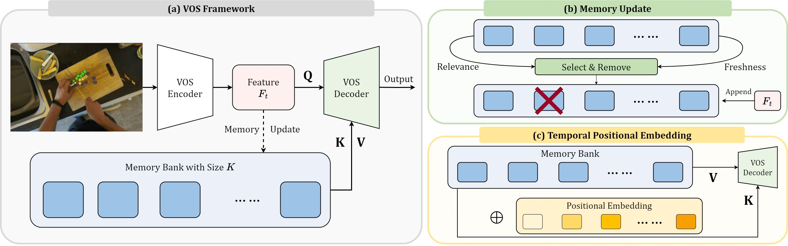

# RMem: Restricted Memory Banks Improve Video Object Segmentation

Junbao Zhou, [Ziqi Pang](https://ziqipang.github.io/), [Yu-Xiong Wang](https://yxw.web.illinois.edu/)

University of Illinois Urbana-Champaign

## Abstract

With recent video object segmentation (VOS) benchmarks evolving to challenging scenarios, we revisit a simple but overlooked strategy: restricting the size of memory banks. This diverges from the prevalent practice of expanding memory banks to accommodate extensive historical information. Our specially designed "memory deciphering" study offers a pivotal insight underpinning such a strategy: expanding memory banks, while seemingly beneficial, actually increases the difficulty for VOS modules to decode relevant features due to the confusion from redundant information. By restricting memory banks to a limited number of essential frames, we achieve a notable improvement in VOS accuracy. This process balances the importance and freshness of frames to maintain an informative memory bank within a bounded capacity. Additionally, restricted memory banks reduce the training-inference discrepancy in memory lengths compared with continuous expansion. This fosters new opportunities in temporal reasoning and enables us to introduce the previously overlooked "temporal positional embedding." Finally, our insights are embodied in "RMem" ("R" for restricted), a simple yet effective VOS modification that excels at challenging VOS scenarios and establishes new state of the art for object state changes (VOST dataset) and long videos (the Long Videos dataset).

## Method Overview



- (a) RMem revisits restricting memory banks to enhance VOS, motivated by the insight from our pilot study.
- (b) To maintain an informative memory bank, we balance both the relevance and freshness of frames when updating the latest features.
- (c) Benefiting from smaller memory size gaps between training and inference, we introduce previously overlooked temporal positional embedding to encode the orders of frames explicitly, which enhances spatio-temporal reasoning. 

## Data preparation

Download the VOST dataset from [vostdataset.org](https://www.vostdataset.org/) , and organize the directory structure as follows:

```bash
├── aot_plus
│   ├── configs
│   ├── dataloaders
│   ├── datasets
│   │   └── VOST
│   │       ├── Annotations
│   │       ├── ImageSets
│   │       ├── JPEGImages
│   │       └── JPEGImages_10fps
│   ├── docker
│   ├── networks
│   ├── pretrain_models
│   └── tools
├── evaluation
└── README.md
```

> hint: you can achieve it by soft link:
> ```bash
> ln -s <your VOST directory>  ./datasets/VOST
> ```

## Checkpoint

| Method            | $\mathcal{J}_{tr}$ | $\mathcal{J}$ |                                  |
| ----------------- | ------------------ | ------------- | -------------------------------- |
| R50 AOTL + RMem   | 39.8               | 50.5          | [download link][aot-ckpt-link]   |
| R50 DeAOTL + RMem | 40.4               | 51.8          | [download link][deaot-ckpt-link] |

Download the checkpoint and put them in `./aot_plus/pretrain_models/`

[aot-ckpt-link]: https://drive.google.com/file/d/1_Wp-zXw2u9zIWRJLYCw-TGaVOKGFaVb_/view?usp=sharing
[deaot-ckpt-link]: https://drive.google.com/file/d/1jMqSOuF5t_W6U7UrKdaX6SH42GSnc78-/view?usp=sharing


## Evaluation

Firstly prepare the pytorch environment. Please follow the instructions on [pytorch.org](https://pytorch.org/) and choose the pytorch version that is most compatible with your machine.

Then
```bash
conda install numpy matplotlib scipy scikit-learn tqdm pyyaml pandas
pip install opencv-python
```

Now you can replicate the result of our checkpoint.
```bash
cd ./aot_plus
./eval_vost.sh
```